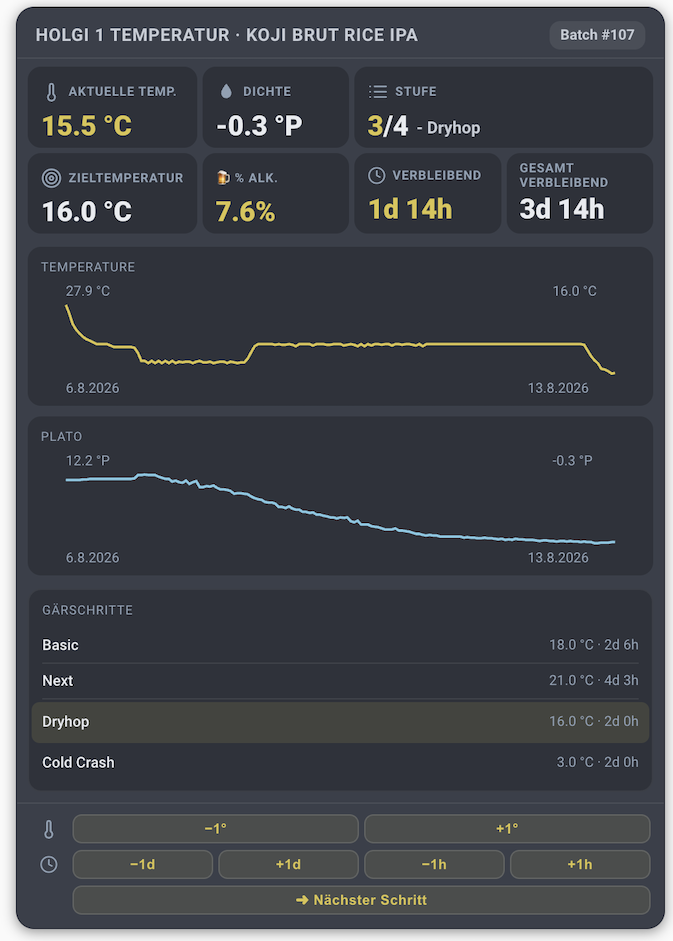

# Home Assistant Grainfather Integration

Custom Home Assistant integration for Grainfather cloud data, including brew sessions, fermentation devices, recipe images, and session controls.

## Support

If this project helps your brewing workflow, you can support development here:

- [Buy Me a Beer](https://buymeacoffee.com/abapblog)

## Features

- Config flow with Grainfather email and password
- Brew session entities with batch, gravity, style, recipe image, and batch variant data
- Recipe metric sensors per brew session: target ABV, IBU, color (SRM), calories, batch size, and boil time
- Extra brew-session sensors: pre-boil gravity, conditioning temperature/duration, fermentation volume, and priming sugar
- Recipe ingredients (fermentables, hops, yeasts, mash steps) exposed as attributes on a per-session recipe sensor
- Brew session attributes including `condition_date`, `fermentation_start_date`, and `created_at`
- Fermentation device temperature and gravity sensors, plus a target-temperature sensor for fermentation controllers
- History data exposed on brew session attributes
- Service actions for changing brew session status and fermentation steps
- Button and select helpers for common brew session actions
- Local integration branding assets for Home Assistant `2026.3+`

## Installation

### HACS

1. Open HACS.
2. Add this repository as a custom repository of type `Integration` if it is not already listed.
3. Install `Grainfather`.
4. Restart Home Assistant.
5. Go to Settings > Devices & Services > Add Integration.
6. Search for `Grainfather` and enter your Grainfather credentials.

### Manual

1. Copy [custom_components/grainfather](custom_components/grainfather) into your Home Assistant `custom_components` directory.
2. Restart Home Assistant.
3. Add the `Grainfather` integration from Settings > Devices & Services.

## Exposed Data

The integration currently polls the Grainfather cloud API and exposes:

- Brew sessions
- Fermentation devices
- Fermentation history linked to devices and sessions
- Recipe images

The implementation is based on the API shape described in [docs/api.md](docs/api.md), including:

- `/api/auth/login`
- `/api/2/brew-sessions`
- `/api/equipment/fermentation-devices`

See [docs/api.md](docs/api.md) for the full Grainfather cloud API reference.

### Brew Session & Recipe Sensors

Each brew session becomes a Home Assistant device with the following sensors. Entity IDs
follow the pattern `sensor.grainfather_<session>_<key>`, where `<session>` is the slug Home
Assistant generates from the device name (for example `sensor.grainfather_batch_01_ibu`).
Look up the exact slugs under **Settings > Devices & Services > Grainfather** or in
**Developer Tools > States** (filter for `grainfather`).

Recipe metric sensors:

| Sensor key | Meaning | Unit |
| --- | --- | --- |
| `target_abv` | Recipe target ABV | `%vol` |
| `ibu` | Bitterness | `IBU` |
| `color_srm` | Beer color | `SRM` |
| `calories` | Estimated calories | `kcal` |
| `batch_size` | Recipe batch size | litres |
| `boil_time` | Boil time | minutes |

Extra brew-session sensors:

| Sensor key | Meaning | Unit |
| --- | --- | --- |
| `pre_boil_gravity` | Pre-boil gravity | (gravity) |
| `conditioning_temperature` | Conditioning temperature | °C |
| `conditioning_duration` | Conditioning duration | days |
| `ferment_volume` | Fermentation volume | litres |
| `priming_sugar` | Priming sugar amount, with `priming_sugar_type` / `priming_sugar_amount` attributes | (amount) |

A sensor reports `unknown` when the underlying field is not present for that session or
recipe yet (for example `target_abv` needs recipe data, and the `conditioning_*` sensors
need those raw fields).

### Recipe Ingredients (attributes)

Each brew session also exposes a `recipe_info` sensor
(`sensor.grainfather_<session>_recipe_info`). Its state is the recipe name, and the recipe
details are exposed as **attributes**:

- `abv`, `ibu`, `srm`, `og`, `fg`
- `fermentables`, `hops`, `yeasts`, `mash_steps` — ingredient lists (each capped at 30 items)

Because these are attributes, a normal card only shows the count/name. Use a Markdown card
with a Jinja template to render them (see the example below). The exact keys inside each
ingredient entry come straight from the Grainfather payload, so inspect one in
**Developer Tools > States** to see fields like `name` and `amount`.

### Fermentation Controller Target Temperature

For fermentation controllers (devices where `fermentation_device_type_id == 30`), an extra
`sensor.grainfather_<device>_target_temperature` (°C) is created. It pairs with the existing
temperature and gravity sensors on the controller.

### Using the New Sensors

Show one brew session's metrics on an **Entities** card:

```yaml
type: entities
title: Batch 01 – Recipe & Metrics
entities:
  - sensor.grainfather_batch_01_target_abv
  - sensor.grainfather_batch_01_ibu
  - sensor.grainfather_batch_01_color_srm
  - sensor.grainfather_batch_01_calories
  - sensor.grainfather_batch_01_batch_size
  - sensor.grainfather_batch_01_boil_time
  - sensor.grainfather_batch_01_pre_boil_gravity
  - sensor.grainfather_batch_01_conditioning_temperature
  - sensor.grainfather_batch_01_conditioning_duration
  - sensor.grainfather_batch_01_ferment_volume
  - sensor.grainfather_batch_01_priming_sugar
```

Show a single metric as a **Gauge**:

```yaml
type: gauge
name: ABV
entity: sensor.grainfather_batch_01_target_abv
min: 0
max: 12
```

Render recipe ingredients with a **Markdown** card (attributes are read via `state_attr`):

```yaml
type: markdown
content: |
  ## {{ states('sensor.grainfather_batch_01_recipe_info') }}
  **ABV** {{ state_attr('sensor.grainfather_batch_01_recipe_info','abv') }} %
  **IBU** {{ state_attr('sensor.grainfather_batch_01_recipe_info','ibu') }}

  ### Hops
  
  - {{ h.name }} {{ h.amount if h.amount is defined else '' }}
  

  ### Fermentables
  
  - {{ f.name }}
  
```

Plot the controller target temperature next to its measured temperature with a
**history-graph**:

```yaml
type: history-graph
title: Fermentation Controller
hours_to_show: 48
entities:
  - sensor.grainfather_conical_temperature
  - sensor.grainfather_conical_target_temperature
```

Alert when the controller drifts away from its target temperature:

```yaml
alias: Fermentation temp drift alert
trigger:
  - platform: template
    value_template: >
      {{ (states('sensor.grainfather_conical_temperature') | float(0)
          - states('sensor.grainfather_conical_target_temperature') | float(0)) | abs > 1.5 }}
action:
  - service: notify.mobile_app_phone
    data:
      message: "Fermentation temp is off target!"
```

## Service Actions

The integration registers these service actions:

1. `grainfather.set_brew_session_status`
2. `grainfather.set_fermentation_steps`
3. `grainfather.set_fermentation_step_duration`

`grainfather.set_brew_session_status` accepts a `status` as either a numeric code or one of:

- `planning`
- `brewing`
- `fermenting`
- `conditioning`
- `serving`
- `completed`

## Branding

This repository includes local branding assets in [custom_components/grainfather/brand](custom_components/grainfather/brand).

- `icon.png` is used for compact integration surfaces
- `logo.png` is used where Home Assistant shows a wider brand image

Home Assistant only uses local custom integration branding from `brand/` starting with version `2026.3`.

## Development

- [custom_components/grainfather](custom_components/grainfather) contains the integration source
- [tests](tests) contains API parsing tests
- [pyproject.toml](pyproject.toml) contains local tooling configuration
- [docs/api.md](docs/api.md) documents the Grainfather cloud API used by the integration

## Lovelace Cards

The repository includes several custom JavaScript cards in [custom_components/grainfather/www](custom_components/grainfather/www).

### Brew Collection Card

`grainfather-brew-collection-card.js` displays multiple brew sessions in a responsive grid with advanced filtering and deduplication.

**Features:**

- Display multiple brew sessions at once (V2 Detailed or V3 Compact layout)
- Filter by status (fermenting, conditioning, serving, brewing, planning, completed)
- Optional deduplication: show only one card per unique batch_number + session name pair
- Optional grouping by status in separate sections
- Responsive grid with configurable layout:
  - fixed cards per row (`cards_per_row`)
  - auto-fit mode with minimum card width (`card_min_width`)

**Example configuration:**

```yaml
resources:
  - url: /grainfather/grainfather-brew-collection-card.js
    type: module

cards:
  - type: custom:grainfather-brew-collection-card
    title: Active Brews
    entities:
      - sensor.grainfather_batch_01_batch_number
      - sensor.grainfather_batch_02_batch_number
      - sensor.grainfather_batch_03_batch_number
    card_type: brew-session-detailed
    statuses: [fermenting, conditioning, serving]
    deduplicate: false
    group_by_status: true
```

**Configuration Options:**

- `title` (string): Display name for the collection
- `entities` (list): Grainfather batch_number sensors to display
- `card_type` (string): Card layout — `brew-session-detailed` (V2) or `brew-session-compact` (V3)
- `statuses` (list): Filter by these statuses (default: all available)
- `deduplicate` (boolean): Show only one card per batch_number + name pair
- `group_by_status` (boolean): Group sessions by status in separate sections
- `cards_per_row` (number): Fixed number of cards per row (`0` = auto-fit mode)
- `card_min_width` (number): Minimum card width in px used by auto-fit mode

### Brew Session Cards (Detailed & Compact)

Display individual brew session details. Cards support `density_unit: default|sg|plato|brix` where `default` uses the integration-wide option.

- Detailed card (V2) includes fermentation steps, current-step highlighting (only while `fermenting`), and step duration formatting (`1d 7h`).
- Compact card (V3) provides a denser summary layout for large dashboards.

### Fermentation Device Card

`grainfather-fermentation-device-card.js` shows live fermentation-device telemetry and active session controls.

Key capabilities:

- Immediate UI response (optimistic updates) for temperature/duration step changes
- Debounced batching of rapid adjustments
- Absolute-value backend updates for safer multi-dashboard use
- Optional fermentation steps list (`show_fermentation_steps`)
- Current-step highlighting only when status is `fermenting`

### On Tap Blackboard Card

`grainfather-on-tap-card.js` renders a pub-style blackboard list of beers currently in status `serving`.

- Shows only: batch number, style, ABV, original gravity
- Filters sessions to `status = serving`
- If a batch appears in multiple variants, only the first variant is shown
- Supports `density_unit: default|sg|plato|brix` on all included brew session cards and the On Tap card
- Mobile-friendly layout: ABV and gravity move to a second line to keep full beer names visible

Example resource and card configuration:

```yaml
resources:
  - url: /grainfather/grainfather-on-tap-card.js
    type: module

cards:
  - type: custom:grainfather-on-tap-card
    max_items: 12
    density_unit: sg
```

## Dashboard UI Overview

Recent dashboard views include:

### Card Picker

Shows all custom Grainfather cards available in Lovelace.


### On Tap Blackboard

Shows serving and coming-soon beers using the blackboard layout.


### Brew Sessions With Compact Card

Shows active sessions with the compact brew session layout.


### Fermentation Device Dashboard

Shows grouped fermentation-device cards for chambers, controllers, and pill sensors.


### Brew Collection With Detailed Card

Shows side-by-side detailed session cards in the collection grid.



These examples reflect the current card behavior and layout options documented above.

## Current Limitations

- The Grainfather cloud API is not officially documented here, so some payload assumptions are based on observed responses.
- Test coverage is focused on payload parsing and client behavior, not full Home Assistant integration runtime behavior.
- The integration currently uses polling rather than push updates.

## Roadmap

1. Add fixture-based tests from captured real API responses.
2. Validate the integration against a live Home Assistant development instance.
3. Expand entity coverage once more Grainfather API fields and workflows are confirmed.

## Support The Project

- [Buy Me a Beer](https://buymeacoffee.com/abapblog)
